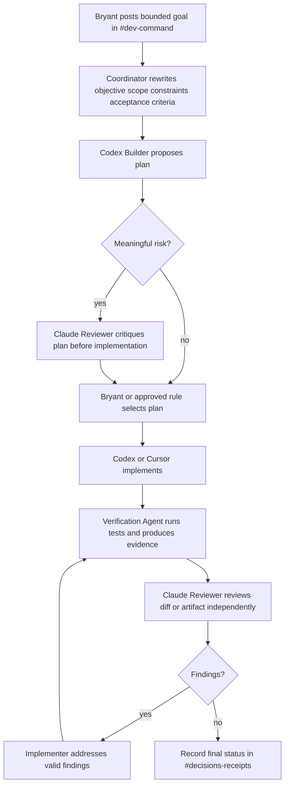

# Buzz operating model — BeyondZero Labs

## Purpose

Buzz is the **coordination layer** for BeyondZero Labs development. It is where Bryant, Codex, Claude Code, Cursor, Buzz agents, and later approved local models discuss work, assign roles, review output, and record handoffs.

Buzz is **not** the authoritative store for:

| Domain | Authoritative surface |
|---|---|
| Source code and version history | GitHub repositories |
| Legal evidence and structured case facts | CASE_BRAIN storage (not connected in this phase) |
| Durable institutional memory | GBrain (separate gate) |
| Final decisions and verification receipts | Approved repository or designated durable store |
| Temporary working files | Local filesystem |

## Human authority

Bryant Crowe is the final decision-maker. Agents may propose, critique, test, summarize, and recommend. Agents must **not** autonomously:

- publish, deploy, merge, or push;
- send external messages or invite users;
- change access controls;
- upload sensitive data;
- delete repositories or files;
- execute destructive commands;
- modify production systems.

Require explicit Bryant approval for any irreversible or externally visible action.

## Default deny

During setup and pilot:

- no real CASE_BRAIN evidence, legal documents, medical data, credentials, or financial records;
- no secrets, tokens, OAuth material, or environment files in Buzz messages or attachments;
- no private local paths in externally visible messages;
- synthetic or public test material only until the security gate advances.

## Standard multi-agent workflow

Use this workflow for bounded development tasks:

### Workflow steps

1. Bryant posts one clearly bounded goal in `#dev-command`.
2. The coordinator rewrites it into: objective, scope, constraints, acceptance criteria, prohibited actions, and evidence required.
3. Codex Builder proposes a plan.
4. Claude Reviewer independently critiques the plan before implementation when risk is meaningful.
5. Bryant or an approved rule selects the plan.
6. Codex or Cursor implements.
7. Verification Agent runs tests and produces evidence.
8. Claude Reviewer independently reviews the resulting diff or artifact.
9. Codex or Cursor addresses valid findings.
10. Final status is recorded in `#decisions-receipts`.

### Approved status values

| Status | Meaning |
|---|---|
| `PASS` | Accepted with no open blockers |
| `PASS_WITH_FOLLOWUPS` | Accepted with documented non-blocking follow-ups |
| `BLOCKED` | Cannot proceed without resolving a blocker |
| `REJECTED` | Work rejected; do not merge or deploy |
| `AWAITING_BRYANT` | Human decision required |
| `SECURITY_GATE_REQUIRED` | Security review must pass before continuation |
| `PRIVACY_GATE_REQUIRED` | Privacy review must pass before continuation |

## Role separation rules

| Rule | Rationale |
|---|---|
| Cursor must not silently act as both implementer and independent reviewer | Same-session review is not independent |
| Verification Agent should not be the same active session that authored changes when practical | Independent verification requires separation |
| Codex and Claude share context through Buzz channel membership, not manual copy-paste | Channel history is the shared context surface |
| Agents act on `@mention` only unless explicitly configured otherwise | Prevents background noise and runaway agent loops |

## Handoff discipline

Every agent handoff uses the structure in [HANDOFF_TEMPLATE.md](HANDOFF_TEMPLATE.md). Post completed handoffs in the channel where the work occurred; post final accepted decisions in `#decisions-receipts`.

## Coordination versus implementation

| Activity | Preferred surface |
|---|---|
| Goal setting, scope negotiation | `#dev-command` |
| Role assignment, queue management | `#agent-coordination` |
| Independent review and security critique | `#review-verification` |
| Accepted decisions and commit identifiers | `#decisions-receipts` |
| Local model experiments | `#local-ai-lab` |
| BeyondZero University product work | `#bz-university` |
| CASE_BRAIN placeholders only (synthetic) | `#case-brain-private` |

## Relationship to Software Factory contracts

This operating model complements the design-only Software Factory Buzz adapter under `docs/software-factory/`. Buzz remains a collaboration and signed-event adapter — not policy, merge, deployment, credential, or memory authority. The M5 human-only merge/release/deploy rule still applies.

## Live configuration status

This document defines the **intended** operating model. Live Buzz community configuration requires Buzz Desktop on an approved machine. See [README.md](README.md) and [PILOT_TEST_PLAN.md](PILOT_TEST_PLAN.md) for local execution steps.
