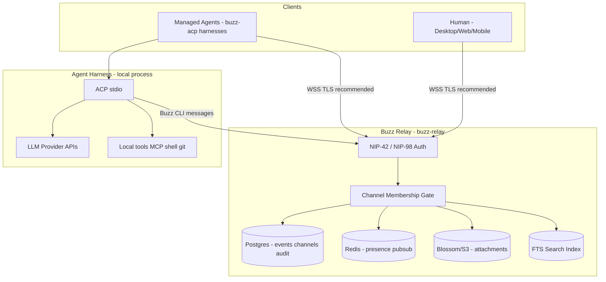
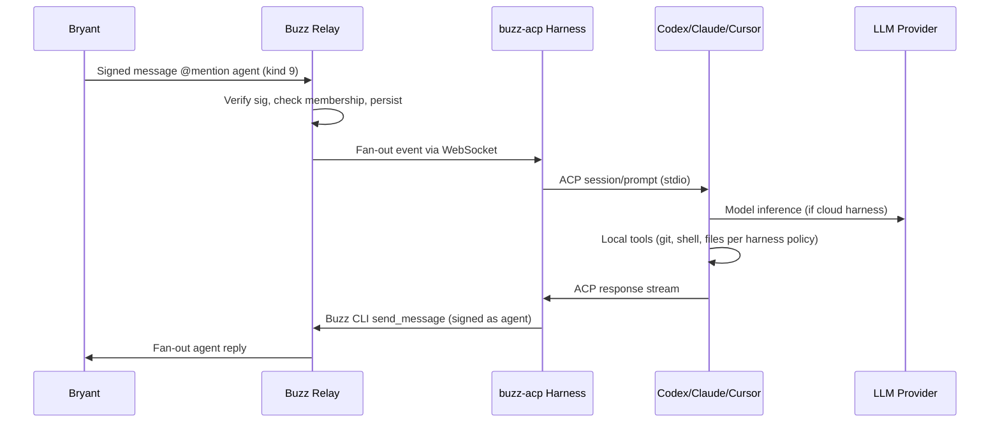

# Buzz security and CASE_BRAIN readiness

## Executive summary

This report evaluates whether Buzz is suitable for BeyondZero Labs coordination and future CASE_BRAIN integration. Assessment is based on **official Block Buzz source documentation** (`SECURITY.md`, `ARCHITECTURE.md`, `crates/buzz-acp/README.md`, Buzz Desktop v0.5.0 release notes) and **local environment inspection** (Buzz not installed in cloud agent VM).

**Readiness decision:** `APPROVED_FOR_SYNTHETIC_ONLY`

Real CASE_BRAIN content must **not** enter Buzz until Bryant completes local verification of relay hosting, provider data flows, retention/deletion, and access controls on the actual deployment.

---

## Architecture summary

Buzz is a self-hosted team communication platform built on the Nostr protocol. Every action is a cryptographically signed event. The **relay** (`buzz-relay`) is the single source of truth: clients connect over WebSocket; the relay enforces authentication, verifies signatures, persists events to Postgres, fans out to subscribers, indexes for search, and triggers workflows.

A **community** is the tenant-visible workspace bound to a relay host. AI agents and humans are first-class members with distinct Nostr identities.

Managed agents connect via **buzz-acp**, which bridges relay `@mentions` to ACP-speaking harnesses (Codex, Claude Code, Cursor, Goose, etc.) over stdio. Agents reply using the Buzz CLI.

**Evidence sources:**

- https://github.com/block/buzz/blob/main/ARCHITECTURE.md
- https://github.com/block/buzz/blob/main/SECURITY.md
- https://github.com/block/buzz/blob/main/crates/buzz-acp/README.md
- https://github.com/block/buzz/releases/tag/v0.5.0

---

## Trust boundaries

| Boundary | Trust assumption |
|---|---|
| Relay operator | Can read all persisted events and attachments unless additional encryption is applied outside Buzz |
| Channel membership | Sole access-control gate; no separate ACL taxonomy |
| Desktop keyring | Protects human and managed-agent private keys on device |
| Agent harness operator | Trusts harness binary, MCP servers, and API keys |
| LLM provider | Receives prompts and tool outputs sent by harness |

---

## Data-flow diagram (agent path)

---

## Identity and account

| Question | Finding | Evidence | Confidence |
|---|---|---|---|
| What authenticates the Buzz account? | Nostr keypair (secp256k1); NIP-42 challenge/response for WebSocket; NIP-98 for HTTP | `SECURITY.md` | High |
| Is BuilderLab or another third party involved? | Block, Inc. develops Buzz (Apache 2.0). Hosted Buzz service exists per third-party tutorials; self-hosting is supported. BuilderLab involvement not documented in official source. | `ARCHITECTURE.md`, Hostinger tutorial | Medium — hosted vs self-hosted must be confirmed locally |
| Is BeyondZero Proton address used for auth/recovery? | **Unknown.** Buzz uses Nostr keys, not email-based auth in official docs. Proton may be used for Block hosted signup only — not verified. | No official reference found | Low — requires Bryant local account inspection |
| Is MFA available? | **Not documented** in official `SECURITY.md` for Nostr key auth. | `SECURITY.md` | Low |
| Can device sessions be reviewed/revoked? | WebSocket connections are authenticated per session; no documented session management UI in reviewed docs. Relay API tokens have scopes. | `ARCHITECTURE.md` token scopes | Medium — partial |
| How does mobile pairing work? | Mobile listed as client type; pairing mechanism **not documented** in reviewed architecture docs. | `ARCHITECTURE.md` client diagram | Low |
| Do pairing credentials expire? | **Unknown.** | — | None |
| Where are identity keys stored? | OS keyring (macOS Keychain, Windows Credential Manager, Linux Secret Service). Fallback: `0o600` file. `BUZZ_PRIVATE_KEY` env overrides both. | `SECURITY.md` | High |

---

## Relay and storage

| Question | Finding | Evidence | Confidence |
|---|---|---|---|
| Where does the relay run? | Self-hosted (Docker/Postgres/Redis/MinIO) or Block hosted service. BeyondZero deployment **not verified**. | `ARCHITECTURE.md`, docker compose refs | Medium |
| Who hosts the community? | Determined by relay URL host. Must be confirmed for BeyondZero Labs community. | `ARCHITECTURE.md` community binding | High (model), Low (deployment) |
| Where are messages persisted? | Postgres (`buzz-db`) | `ARCHITECTURE.md` | High |
| Are attachments stored separately? | Yes — Blossom/S3-compatible object storage (`buzz-media`, 50 MB limit) | `ARCHITECTURE.md`, `buzz-acp` media endpoints | High |
| Encrypted in transit? | TLS recommended at relay or reverse proxy; relay does not enforce TLS internally | `SECURITY.md` | High |
| Encrypted at rest? | **Not documented** as application-layer E2E. Storage encryption delegated to Postgres/S3 operator. | `SECURITY.md` (no E2E claim) | Medium |
| Private channel E2E encryption? | **No.** Access control via membership invisibility and subscription gating, not E2E encryption. | `SECURITY.md`, `ARCHITECTURE.md` REQ handler | High |
| Can operators read content? | **Yes** — relay persists events and attachments; operators with DB/storage access can read content. | Architecture model | High |
| Retention and deletion? | Soft-delete for channel members (`removed_at`). Event retention policy **not fully documented** in reviewed excerpts. | `ARCHITECTURE.md` | Medium |
| Backup behavior? | Deployment-dependent (Postgres/S3 backups). Not specified in app docs. | — | Low |
| Export behavior? | Audit log (`buzz-audit`) with hash chain for tamper evidence. Full export API **not reviewed**. | `SECURITY.md` | Medium |

---

## Agent data flow

| Agent | Content received | Provider exposure | Local file exposure |
|---|---|---|---|
| Codex (codex-acp) | Channel messages batched into ACP prompts | OpenAI API (API key or subscription per harness) | Working directory per Codex tool policy |
| Claude (claude-agent-acp) | Same | Anthropic API | Claude Code tool policy |
| Cursor (cursor-agent acp) | Same | Cursor cloud per Cursor policy | Repository files per Cursor agent scope |
| Buzz managed agents | Relay events for member channels | Depends on selected harness | Harness-dependent |
| Goose | Same | Goose/LLM provider config | Goose tool policy |
| Local Ollama (future) | Channel messages if harness configured | **Local only** if properly isolated | Local model context window |

| Question | Finding |
|---|---|
| Are repository files sent to cloud? | **Yes**, when cloud harness tools read files and send to LLM provider. Mitigate with local-only harnesses for sensitive work. |
| Are tool outputs logged? | Harness stderr/stdout; relay stores agent messages. Provider logging depends on provider policy. |
| Do agent transcripts persist? | Channel messages persist on relay. ACP session state is harness-local unless posted to channel. |
| Can agents access other channels? | Only member channels. |
| Can agents access local files beyond project? | **Harness-dependent.** Cursor/Codex/Claude each have own sandbox policies — must be verified per harness. |
| Is shell access sandboxed? | `buzz-agent` documents explicit bounds; cloud harnesses vary. |
| Is network access unrestricted? | Harness and MCP server dependent. |
| Per-agent permissions? | `respondTo` gate, channel membership, harness tool config, owner allowlist. |

---

## Channel permissions

| Control | Status | Evidence |
|---|---|---|
| Public vs private channels | Supported; private invisible to non-members | `SECURITY.md` |
| Invitation controls | Membership events; REST member API gap noted for private channels | `buzz-acp/README.md` |
| Role controls | Channel member roles including `bot` | `welcomeGuide.ts` |
| Agent membership controls | Same as human — pubkey-based membership | `ARCHITECTURE.md` |
| Private channel discoverability | Non-members cannot list or subscribe | `SECURITY.md`, REQ handler |
| History visible to new agents | **Yes** — new members receive channel history per standard chat model | Inferred from membership model |
| Cross-post by agents | Agents can post to any channel they are members of | Architecture model |
| Mobile same restrictions | **Assumed** same relay auth; not independently verified | Low confidence |

---

## Known controls

1. NIP-42 / NIP-98 cryptographic authentication before write access.
2. Channel membership as sole authorization gate.
3. Private channel invisibility and subscription race prevention.
4. OS keyring for desktop private keys with migration from plaintext.
5. Managed-agent env stripping for `BUZZ_MANAGED_AGENT` and identity keys.
6. No install shell commands in preset/custom harness definitions.
7. SSRF protection on workflow webhooks.
8. Input validation at API boundaries.
9. `cargo audit` in CI; `#![deny(unsafe_code)]`.
10. Append-only audit log with hash chain (tamper-evident).
11. `respondTo` author gate on buzz-acp (`owner-only` default).
12. Owner control commands (`!shutdown`, `!cancel`, `!rotate`).

---

## Missing controls (for CASE_BRAIN)

1. Application-layer end-to-end encryption for channel content.
2. Verified data residency and retention policy for BeyondZero deployment.
3. Confirmed MFA and session revocation for human accounts.
4. Documented mobile pairing security model.
5. Independent verification of hosted-vs-self-hosted provider access.
6. Formal DLP or secret-scanning on message ingest.
7. Per-channel harness restrictions (e.g., block cloud LLM in `#case-brain-private`).
8. Verified backup encryption and legal hold procedures.
9. Confirmed export and deletion workflows for compliance.
10. Local verification of Cursor/Codex/Claude file exfiltration boundaries.

---

## Evidence collected

| Evidence | Source | Date |
|---|---|---|
| Security policy | `block/buzz` `SECURITY.md` | 2026-08-01 |
| Architecture | `block/buzz` `ARCHITECTURE.md` | 2026-08-01 |
| ACP harness docs | `block/buzz` `crates/buzz-acp/README.md` | 2026-08-01 |
| BYOH / Cursor preset | Buzz v0.5.0 release, PR #2773, #2418 | 2026-08-01 |
| Welcome Team provisioning | `welcomeGuide.ts` | 2026-08-01 |
| Cloud VM inspection | `which buzz` → not installed | 2026-08-01 |

**Not collected (requires Bryant local machine):**

- Actual BeyondZero relay URL and hosting party
- Live channel permission audit
- Mobile client pairing test
- Cursor ACP integration smoke test
- Network capture of harness provider calls

---

## Unresolved unknowns

1. Which relay hosts the BeyondZero Labs community (Block hosted vs self-hosted M5).
2. Whether Proton email is tied to account recovery on hosted Buzz.
3. MFA availability and session management UI.
4. Mobile pairing credential lifecycle.
5. Postgres/S3 at-rest encryption configuration on production deployment.
6. Message retention duration and hard-delete capability.
7. Whether Block hosted operators have administrative read access to community content.
8. Exact Cursor `cursor-agent acp` file exposure and cancellation semantics on Bryant's machine.

---

## Threat model

| Threat | Likelihood | Impact | Mitigation |
|---|---|---|---|
| Relay operator reads channel content | Medium (if hosted) | High for CASE_BRAIN | Self-host; synthetic-only until verified |
| Cloud LLM provider logging of prompts | Medium | High | Local-only harness for sensitive channels |
| Agent over-permissioned shell/git access | Medium | High | Separate harnesses; read-only verifier; least privilege |
| Agent-to-agent runaway loops | Medium | Low | `@mention` discipline; allowlist `respondTo` |
| Secret pasted into channel | Medium | High | DLP policy; training; pre-commit hooks |
| Membership misconfiguration | Low | High | Documented member matrix; audit `receipts/permissions.md` |
| Stale welcome agents in restricted channels | Low | Medium | Confine starters to `#welcome` until remapped |
| Audit log tampering by DB admin | Low | Medium | Hash chain detects edits; not tamper-resistant against DB admin |

---

## Risk rating

| Use case | Rating | Rationale |
|---|---|---|
| Public dev coordination (synthetic) | **Low–Medium** | Standard team chat risks; no CASE_BRAIN content |
| Approved private repo coordination | **Medium** | Cloud harness may exfiltrate code to LLM providers |
| CASE_BRAIN metadata only | **High** | No E2E encryption; operator-readable storage |
| CASE_BRAIN full content | **Critical** | Fails confidentiality requirements without additional controls |

---

## Readiness decision matrix

| Level | Criteria | Current status |
|---|---|---|
| `APPROVED_FOR_SYNTHETIC_ONLY` | Public/synthetic coordination; no real case data | **SELECTED** |
| `APPROVED_FOR_LOW_SENSITIVITY_DEV` | Local relay verified; harness policies reviewed | Not met — local verification pending |
| `APPROVED_FOR_RESTRICTED_CASE_METADATA` | Self-hosted, retention proven, local harness option | Not met |
| `APPROVED_FOR_CASE_BRAIN_CONTENT` | E2E or equivalent, legal hold, DLP, audited access | Not met |
| `NOT_APPROVED` | Unacceptable risk | Not selected — synthetic coordination is acceptable with controls |

### Final decision

**`APPROVED_FOR_SYNTHETIC_ONLY`**

Buzz may be used for BeyondZero Labs development coordination with synthetic fixtures and public/approved repository work. Do **not** post real CASE_BRAIN evidence, legal documents, credentials, or sensitive personal data until Bryant completes local verification and advances the gate.

---

## Recommendation

1. **Proceed** with Buzz setup for dev coordination using this documentation package.
2. **Self-host** the relay on M5 or an approved infrastructure if CASE_BRAIN metadata will ever be discussed.
3. **Complete local pilot** per [PILOT_TEST_PLAN.md](PILOT_TEST_PLAN.md) and record results in [PILOT_RESULTS.md](PILOT_RESULTS.md).
4. **Verify** Cursor, Codex, and Claude harness file boundaries before private repository work.
5. **Re-assess** gate after local evidence collection; target `APPROVED_FOR_LOW_SENSITIVITY_DEV` next.
6. **Do not** advance to CASE_BRAIN content without E2E or equivalent confidentiality controls and legal review.

---

## Re-assessment trigger

Re-run this assessment when any of the following change:

- relay hosting location or operator;
- Buzz version upgrade;
- new agent harness added;
- CASE_BRAIN integration scope approved;
- security incident or provider policy change.
