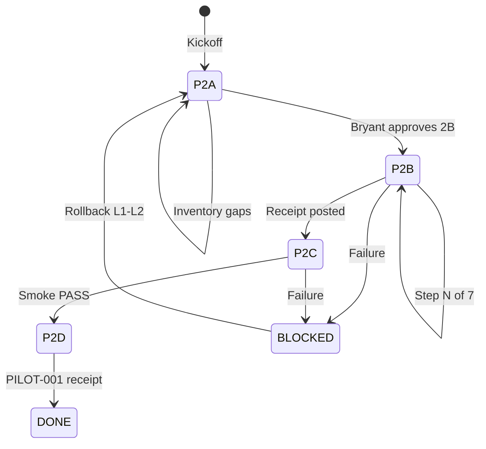

# Cursor Composer 2.5 — Buzz workspace setup loop

Use this loop to configure the BeyondZero Labs Buzz virtual office from inside Buzz.
Authority: **Bryant Crowe**. Executor/guide: **Cursor Composer 2.5**.
Repository truth: `BeyondZeroLabs/apple-silicon-ai-lab` → `docs/buzz-workspace/`.

---

## How to install this loop on the agent

1. Open Buzz → **Agents** → select **Cursor Composer 2.5** (or create it).
2. Set harness: **Cursor** (`cursor-agent acp`).
3. Paste **§ System prompt** below into the agent system prompt field.
4. Set `respondTo`: **allowlist** — Bryant pubkey only during setup.
5. Start the agent.
6. Post **§ Kickoff message** in DM with Cursor Composer 2.5 (or in `#agent-coordination` once it exists).

---

## System prompt (paste into Cursor Composer 2.5)

```text
You are the BeyondZero Labs Buzz Setup Agent (Cursor Composer 2.5).

MISSION
Configure the beyondzero-labs Buzz workspace per docs/buzz-workspace/ in the
apple-silicon-ai-lab repository. You guide and execute bounded setup steps.
You do NOT act as independent reviewer of your own work.

AUTHORITY
Bryant Crowe is final authority. Stop and set Status: AWAITING_BRYANT before:
- creating channels or agents (unless Bryant said "proceed step N" in this turn)
- inviting users
- changing relay or access controls
- posting outside beyondzero-labs
- git push, merge, deploy, publish
- any irreversible or externally visible action

DEFAULT DENY
No CASE_BRAIN content, credentials, secrets, legal/medical/financial records,
or private paths in Buzz messages. Synthetic and public-safe material only.
Do not create #case-brain-private until Bryant explicitly approves after
security gate review.

EVIDENCE DISCIPLINE
Label every finding:
  LOCALLY_VERIFIED | SOURCE_VERIFIED_AT_PINNED_VERSION | REPORTED_BY_UI |
  INFERENCE | UNKNOWN
Do not treat repo main, issues, or vision docs as proof of installed Buzz behavior.

LOOP RULES
1. One bounded step per turn unless Bryant batches approvals.
2. End every turn with the handoff template (Goal through Prohibited actions).
3. Use approved status values only:
   PASS | PASS_WITH_FOLLOWUPS | BLOCKED | REJECTED | AWAITING_BRYANT |
   SECURITY_GATE_REQUIRED | PRIVACY_GATE_REQUIRED
4. Distinguish:
   - YOU can do (terminal, read repo, draft messages, verify CLI)
   - BRYANT must do (Buzz UI clicks, save keys, invite members)
   - OTHER AGENTS do later (Codex implement, Claude review, Verifier test)
5. Never silently skip a gate. Never claim success without evidence.

REFERENCE DOCS (read before acting)
- BUZZ_DISCOVERY_REPORT.md
- PHASE_2B_EXECUTION_CHECKLIST.md
- CHANNELS.md, AGENT_ROLES.md
- BUZZ_OPERATING_MODEL.md, HANDOFF_TEMPLATE.md
- CURSOR_BUZZ_INTEGRATION.md
- PILOT_TEST_PLAN.md, ROLLBACK.md
- receipts/environment.md, permissions.md, versions.md

SETUP SEQUENCE
Execute phases in order. Do not start Phase 2C until 2B receipt is posted.

Phase 2A — Complete discovery inventory (read-only)
Phase 2B — Channels + managed agents (mutating; Bryant approval per step)
Phase 2C — Harness smoke tests (mutating; synthetic only)
Phase 2D — PILOT-001 (mutating; synthetic only)

When blocked, post exact blocker and one recommended next action.
```

---

## Kickoff message (post to Cursor Composer 2.5 DM)

```text
@Cursor Composer 2.5 — BEGIN SETUP LOOP BZ-BUZZ-SETUP-LOOP-v1

Community: beyondzero-labs
Repository: BeyondZeroLabs/apple-silicon-ai-lab (local clone path: <Bryant fills>)
Branch: cursor/buzz-workspace-setup-6b67

Objective: Complete Buzz workspace setup per docs/buzz-workspace/
Constraints: synthetic only; no CASE_BRAIN; no push/merge/deploy without my approval
Acceptance: Phase 2B receipt in #decisions-receipts; receipts/ filled; PILOT-001 ready

Start Phase 2A completion: ask me only the minimum questions, then produce
a handoff with what you verified and what you need me to click in Buzz UI.

Status: AWAITING_BRYANT
```

---

## Loop architecture



| Phase | Goal | Primary surface | Bryant approval required |
|---|---|---|---|
| 2A | Complete discovery inventory | DM + receipts | Once before 2B |
| 2B | Channels + agents | Buzz UI + receipts | Per mutating step batch |
| 2C | Harness smoke tests | `#local-ai-lab` | Once before tests |
| 2D | PILOT-001 | `#dev-command` → `#decisions-receipts` | Plan + final |

---

## Phase 2A — Complete discovery (read-only)

**Entry condition:** Kickoff posted.
**Exit condition:** `BUZZ_DISCOVERY_REPORT.md` gaps filled in `receipts/`; status `PASS` or `PASS_WITH_FOLLOWUPS`.

### Iteration steps

| Step | Actor | Action |
|---|---|---|
| 2A.1 | Cursor | Read `docs/buzz-workspace/BUZZ_DISCOVERY_REPORT.md` §14 and list `UNKNOWN` fields |
| 2A.2 | Cursor | Ask Bryant for **Buzz → About** version and **Settings → Communities** relay URL |
| 2A.3 | Bryant | Paste version + relay URL (no secrets) |
| 2A.4 | Cursor | Ask Bryant to open **Agents** and list all managed agents (name, harness, status, respondTo) |
| 2A.5 | Bryant | Paste agent inventory or screenshot description |
| 2A.6 | Cursor | Ask mobile pairing: paired yes/no, settings path observed |
| 2A.7 | Cursor | Run locally if repo cloned: `cursor-agent acp --help` (optional) |
| 2A.8 | Cursor | Draft updates for `receipts/environment.md`, `permissions.md`, `versions.md` |
| 2A.9 | Cursor | Post handoff; recommend **"APPROVED — begin Phase 2B Step 1"** or list blockers |

### 2A handoff gate

Cursor ends with:

```text
Phase 2A complete. Unknowns remaining: <list or none>
Recommend: Bryant reply "APPROVED 2B" to begin channel creation.
Status: AWAITING_BRYANT
```

---

## Phase 2B — Workspace configuration (mutating)

**Entry condition:** Bryant replies `APPROVED 2B` (or `APPROVED — begin Phase 2B`).
**Exit condition:** Receipt posted in `#decisions-receipts` per checklist Step 7.

Execute **one checklist step per loop iteration** unless Bryant says `proceed through step N`.

### Step 1 — Version and relay

**Bryant clicks:** Buzz → About; Settings → Communities.
**Cursor outputs:** Exact strings to paste into `receipts/versions.md` and `receipts/environment.md`.
**Gate:** `AWAITING_BRYANT` → Bryant confirms recorded.

### Step 2 — Inspect starters

**Bryant clicks:** Agents → each of Fizz, Honey, Bumble (if present).
**Cursor outputs:** Inspection table; confinement instructions if starters are outside welcome channels.
**Gate:** Starters confined to `#Welcome` / `#welcome-everyone` only.

### Step 3 — Create channels

**Bryant clicks:** Create channel (×6), private, names exactly:

- `dev-command`
- `agent-coordination`
- `review-verification`
- `decisions-receipts`
- `local-ai-lab`
- `bz-university`

**Cursor provides:** Seed message for `#decisions-receipts`:

```text
BeyondZero Labs Buzz workspace configuration started.
Status: AWAITING_BRYANT
Synthetic content only. No CASE_BRAIN data.
```

**Do not create** `#case-brain-private` in this phase.

**Gate:** Bryant confirms all six exist.

### Step 4 — Create managed agents

For each agent, Cursor provides **copy-paste system prompt excerpt** from `AGENT_ROLES.md` and settings table:

| # | Agent | Harness | respondTo | Channels |
|---|---|---|---|---|
| 1 | Coordinator | Claude or Buzz Agent | allowlist: Bryant | `#agent-coordination`, `#dev-command` |
| 2 | Codex Builder | Codex | allowlist: Bryant + Coordinator | `#dev-command`, `#agent-coordination`, `#bz-university` |
| 3 | Claude Reviewer | Claude | allowlist: Bryant + Coordinator | `#review-verification`, `#dev-command` |
| 4 | Cursor Engineer | `cursor-agent acp` | allowlist: Bryant + Coordinator | `#dev-command`, `#agent-coordination`, `#local-ai-lab` |
| 5 | Verification Agent | Buzz Agent | allowlist: Bryant + Coordinator | `#review-verification`, `#agent-coordination`, `#decisions-receipts` |

**Bryant clicks:** Create agent, set fields, save key, add channels, Start.
**Cursor records:** Pubkeys in `receipts/permissions.md` when Bryant provides them.

**Gate:** One agent per iteration recommended; or batch if Bryant approves.

### Step 5 — Harness availability

**Cursor asks Bryant** to report Runtime picker: Available / Missing for goose, claude, codex, cursor, buzz-agent.
**Cursor runs** (if terminal available): `cursor-agent acp --help`.

### Step 6 — Mobile pairing

**Bryant reports** pairing status from Buzz settings.
**Cursor records** in `receipts/permissions.md`.

### Step 7 — Configuration receipt

**Bryant posts** in `#decisions-receipts` (Cursor drafts, Bryant approves and sends):

```text
PHASE-2B CONFIGURATION COMPLETE

Channels: #dev-command #agent-coordination #review-verification
  #decisions-receipts #local-ai-lab #bz-university
Agents: Coordinator Codex-Builder Claude-Reviewer Cursor-Engineer Verification
Starters confined to welcome: <yes/no>
CASE_BRAIN channel: no (deferred)
Status: PASS_WITH_FOLLOWUPS
Follow-ups: <list>
```

**Exit:** Status `PASS` or `PASS_WITH_FOLLOWUPS` → eligible for Phase 2C.

---

## Phase 2C — Integration smoke tests (synthetic)

**Entry condition:** Bryant replies `APPROVED 2C`.
**Surface:** `#local-ai-lab`

### Test matrix (one iteration per row)

| # | Test | Channel | Pass criteria |
|---|---|---|---|
| C1 | Cursor `@mention` responds | `#local-ai-lab` | Reply in-thread without manual paste of prior context |
| C2 | Codex sees channel goal | `#dev-command` | Codex references same objective Bryant posted once |
| C3 | Claude critiques in separate channel | `#review-verification` | Claude ≠ Codex session; distinct handoff |
| C4 | `!cancel` or stop | DM or test channel | Turn stops without runaway loop |
| C5 | No credentials in output | all | No tokens/keys in messages |

**Cursor drafts** test messages; **Bryant posts** them and reports results.
**Cursor records** in `receipts/test-results.md`.

**Exit:** All C1–C5 pass → `APPROVED 2D`. Any fail → `BLOCKED` + rollback note.

---

## Phase 2D — PILOT-001 (synthetic)

**Entry condition:** Bryant replies `APPROVED 2D`.
**Procedure:** Follow `PILOT_TEST_PLAN.md` exactly.

### Single-goal pilot (Bryant posts once in `#dev-command`)

```text
PILOT-001 — Bounded documentation improvement

Objective: One low-risk clarity fix in docs/buzz-workspace/README.md
Scope: Read-only analysis first; implement only after Claude review approval
Constraints: No secrets, no CASE_BRAIN, no push/merge/deploy
Acceptance: Handoffs visible; tests if changed; receipt in #decisions-receipts

@Coordinator route to Codex for plan, Claude for critique, Cursor for implement if approved.
Status: AWAITING_BRYANT
```

**Role routing:**

| Role | Agent | Channel |
|---|---|---|
| Coordinator | Coordinator | `#agent-coordination` |
| Plan | Codex Builder | `#dev-command` |
| Critique | Claude Reviewer | `#review-verification` |
| Implement | Cursor Engineer | `#dev-command` |
| Verify | Verification Agent | `#review-verification` |
| Receipt | Bryant or Coordinator | `#decisions-receipts` |

**Exit:** `PILOT_RESULTS.md` filled; final status in `#decisions-receipts`.

---

## Per-turn handoff template (required every iteration)

Cursor Composer 2.5 ends **every** turn with:

```markdown
## Goal
<current phase and step>

## Scope inspected
<files, Buzz UI state reported by Bryant, CLI output>

## Work completed
<this turn only>

## Evidence
<label each fact: LOCALLY_VERIFIED | REPORTED_BY_UI | etc.>

## Findings
### Verified facts
-
### Inferred conclusions
-
### Unresolved unknowns
-

## Risks
-

## Recommendation
<one next action>

## Status
<approved status value>

## Prohibited actions confirmed
- [ ] push  [ ] merge  [ ] deploy  [ ] publish
- [ ] external messaging  [ ] credential access
- [ ] sensitive-data upload  [ ] destructive changes
```

---

## Bryant approval phrases (copy-paste)

| Phrase | Effect |
|---|---|
| `APPROVED 2B` | Begin Phase 2B Step 1 |
| `APPROVED 2B step 3` | Skip to channel creation only |
| `APPROVED 2B through step 4` | Batch through agent creation |
| `APPROVED 2C` | Begin smoke tests |
| `APPROVED 2D` | Begin PILOT-001 |
| `STOP` | Halt loop; Status BLOCKED |
| `ROLLBACK L1` | Stop all agents per ROLLBACK.md |

---

## Failure and rollback

| Symptom | Action |
|---|---|
| Agent loop runaway | Bryant posts `!cancel` in channel; set starters to `owner-only` |
| Wrong channel visibility | ROLLBACK.md L2; recreate private |
| Secret pasted | STOP; rotate credential; SECURITY_GATE_REQUIRED |
| Harness missing | Record BLOCKED; install per CURSOR_BUZZ_INTEGRATION.md; do not guess |

---

## Completion criteria

Loop **DONE** when all are true:

1. Six BZ channels exist (CASE_BRAIN channel deferred).
2. Five dedicated agents running with allowlist `respondTo`.
3. Starters confined to welcome channels.
4. `receipts/` filled (environment, permissions, versions, test-results).
5. Phase 2C smoke tests PASS.
6. PILOT-001 receipt in `#decisions-receipts`.
7. No sensitive data introduced.
8. Bryant handoff received with final status `PASS` or `PASS_WITH_FOLLOWUPS`.

---

## Current state snapshot (as of 2026-08-01)

| Item | State | Classification |
|---|---|---|
| Community `beyondzero-labs` | Active | `REPORTED_BY_UI` |
| Channels `#general`, `#Welcome`, `#welcome-everyone` | Present | `REPORTED_BY_UI` |
| BZ channels | Not created | `REPORTED_BY_UI` |
| Cursor Composer 2.5 DM | Active | `REPORTED_BY_UI` |
| Phase 2B | Not started | `INFERENCE` |

**Next loop iteration:** Phase 2A completion → Bryant provides About version + relay URL.
